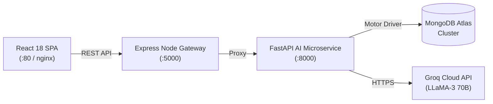

# 🛡️ Enterprise CX Guardian AI — Production AI Microservice & Conversational Platform

[](https://github.com/enterprise-cx/ai-microservice/actions/workflows/ci.yml)
[](https://fastapi.tiangolo.com)
[](https://nodejs.org)
[](https://react.dev)
[](https://www.mongodb.com)
[](https://www.docker.com)
[](#license)

**Enterprise CX Guardian AI** is an enterprise-grade, multi-tier AI microservice architecture and conversational intelligence platform designed for high-throughput customer experience automation, real-time ticket analytics, and automated SLA management. Built with **FastAPI**, **Node.js Express**, **React 18 + Vite**, and **MongoDB**, powered by **Groq LLaMA-3 (70B)**.

---

## 📋 Table of Contents

- [Project Overview](#-project-overview)
- [Key Features](#-key-features)
- [System Architecture](#-system-architecture)
- [Tech Stack](#-tech-stack)
- [Installation & Setup](#-installation--setup)
- [Deployment Guide](#-deployment-guide)
- [API Documentation & Endpoints](#-api-documentation--endpoints)
- [Folder Structure](#-folder-structure)
- [Future Scope & Roadmap](#-future-scope--roadmap)
- [Screenshots](#-screenshots)

---

## 🎯 Project Overview

Enterprise CX Guardian AI addresses the scalability, persistence, and compliance challenges of enterprise customer interaction management. It replaces ad-hoc LLM wrappers with a hardened AI microservice featuring:

- **10-Step Chat Execution Pipeline**: State-machine-driven prompt assembly, token tracking, and dual-layer persistence.
- **Clean Architecture Infrastructure Layer**: Interface abstraction (`IConversationRepository`, `IMessageRepository`, `IPromptRepository`, `IUsageRepository`) allowing zero-downtime database swapping (MongoDB ↔ Redis ↔ PostgreSQL ↔ Azure Cosmos DB).
- **Soft Delete Lifecycle**: Full audit compliance supporting `ACTIVE`, `ARCHIVED`, and `DELETED` states.
- **In-Memory Telemetry & Metrics Engine**: Rolling window metrics tracking p50/p90/p99 latencies, error rates, and system utilization.

---

## ✨ Key Features

### 1. Conversational AI Core
- **Groq LLaMA-3-70B Engine**: Sub-100ms inference response times.
- **Sliding History Window**: Dynamically bounds prompt size (`MAX_HISTORY` turns) to maintain context without token overflow.
- **Prompt Auditing**: Automatically saves every raw prompt payload into `prompt_logs` for compliance and optimization.
- **Token Telemetry**: Captures `prompt_tokens`, `completion_tokens`, `total_tokens`, and `latency_ms` on every completion.

### 2. Multi-Service Architecture & API Versioning
- **Dual API Support**: Clean `/api/v1` namespace with built-in `/api/v2` migration readiness and `/api/versions` discovery endpoint.
- **Decoupled Gateway**: Express Node.js backend handles client session routing while delegating AI inference to the FastAPI microservice.

### 3. Production Security & Hardening
- **Secure Headers (Helmet)**: Strict CSP, HSTS, X-Frame-Options: DENY, X-Content-Type-Options: nosniff.
- **Sliding Window Rate Limiting**: Per-IP limits across Auth (10/min), Chat (60/min), and API (200/min).
- **Input Sanitization**: XSS, script tag, and null-byte (`\x00`) stripping across query and payload segment parsing.
- **Request Size Guards**: Hard payload limits preventing request smuggling or payload inflation attacks.

### 4. Performance & Optimization
- **Dual Response Compression**: GZip compression for responses > 512 bytes.
- **In-Memory ETag Cache**: Read caching with `304 Not Modified` conditional validation and automated mutation cache-busting.
- **MongoDB Index Suite**: Auto-creating compound, unique, and TTL self-expiring indexes.
- **Async Background Task Queue**: Offloads non-blocking analytics and telemetry writes to background workers.

---

## 🏗️ System Architecture

Full system, sequence, ER, and microservice diagrams are detailed in [`docs/architecture.md`](docs/architecture.md).



---

## 💻 Tech Stack

| Layer | Technology |
|---|---|
| **Frontend UI** | React 18, Vite, TailwindCSS, Lucide Icons |
| **Backend Gateway** | Node.js 20, Express, Winston Logger |
| **AI Microservice** | Python 3.11, FastAPI, Pydantic v2, Motor |
| **Database** | MongoDB 7.0 (Atlas / Containerized) |
| **LLM Provider** | Groq Cloud API (llama3-70b-8192) |
| **Containerization** | Docker, Multi-Stage Builds, Docker Compose |
| **CI/CD** | GitHub Actions Workflow (`.github/workflows/ci.yml`) |

---

## ⚙️ Installation & Setup

### Prerequisites
- **Docker Desktop** >= 24.0 (Recommended for one-command startup)
- **Node.js** >= 20.x & **npm** >= 10.x
- **Python** >= 3.11

### Quick Start (One-Command Docker Compose)

```bash
# 1. Clone repository
git clone https://github.com/enterprise-cx/ai-microservice.git
cd ai-microservice

# 2. Configure environment
cp .env.example .env
# Edit .env and set your GROQ_API_KEY

# 3. Launch full stack
docker compose up --build
```

Access endpoints:
- **Frontend SPA**: `http://localhost:80`
- **Node Backend Gateway**: `http://localhost:5000`
- **FastAPI AI Microservice**: `http://localhost:8000`
- **Interactive Swagger Docs**: `http://localhost:8000/docs`

---

## 🚀 Deployment Guide

Detailed step-by-step deployment instructions for cloud platforms are documented in [`docs/deployment.md`](docs/deployment.md):

- **Frontend SPA** → Deployed to **Vercel** ([`client/vercel.json`](client/vercel.json))
- **Node Gateway** → Deployed to **Render** ([`server/render.yaml`](server/render.yaml))
- **FastAPI AI Service** → Deployed to **Render** ([`ai-service/render.yaml`](ai-service/render.yaml))
- **Database** → **MongoDB Atlas**

---

## 📡 API Documentation & Endpoints

### Health & Monitoring
- `GET /` — Minimal liveness ping
- `GET /health` — Full health status (Database, Requests, Memory)
- `GET /health/live` — Kubernetes liveness probe
- `GET /health/ready` — Kubernetes readiness probe
- `GET /metrics` — Request counters, latency percentiles, system CPU/memory
- `GET /api/versions` — API version discovery

### Core AI & Conversations (`/api/v1`)
- `POST /api/v1/chat` — Execute 10-step chat execution flow
- `GET /api/v1/conversations` — List conversations (limit, page, sort, status)
- `GET /api/v1/conversations/{id}` — Fetch conversation details & message history
- `DELETE /api/v1/conversations/{id}` — Soft delete conversation (`status = DELETED`)
- `PATCH /api/v1/conversations/{id}/archive` — Archive conversation (`status = ARCHIVED`)
- `PATCH /api/v1/conversations/{id}/restore` — Restore conversation (`status = ACTIVE`)

### Dashboard & Analytics (`/api/v1/dashboard`)
- `GET /api/v1/dashboard/summary` — Key KPI overview
- `GET /api/v1/dashboard/health` — Detailed CPU, memory & DB latency
- `GET /api/v1/dashboard/model-usage` — LLM token consumption & throughput
- `GET /api/v1/dashboard/conversations` — Status breakdown
- `GET /api/v1/dashboard/users` — Active user sessions & roles
- `GET /api/v1/dashboard/documents` — Knowledge base & RAG hit rates

---

## 📂 Folder Structure

```
AI-MicroService/
├── client/                     # React 18 + Vite SPA Frontend
│   ├── src/components/         # SkeletonLoader, Toast, ThemeToggle, EmptyState
│   ├── src/context/            # ThemeContext, ToastContext
│   ├── src/pages/              # ManagerDashboard, ChatPage, NotFoundPage
│   └── vercel.json             # Vercel deployment config
├── server/                     # Node.js 20 Express Gateway
│   ├── config/                 # Winston centralized 7-category logger
│   ├── middleware/             # Security (Helmet, CORS, Rate Limit) & Performance (Compression, Cache)
│   ├── repositories/           # Clean Architecture Storage Adapters (inMemory / mongodb)
│   ├── seed/                   # Database seeder script
│   └── render.yaml             # Render service manifest
├── ai-service/                 # FastAPI Python AI Microservice
│   ├── app/core/               # Settings, structured logger, metrics collector
│   ├── app/database/           # Motor async MongoDB connection manager
│   ├── app/middleware/         # Security headers, rate limiting, size limit, compression, cache
│   ├── app/repositories/       # Clean Architecture storage repositories & factory
│   ├── app/routers/            # Versioned API routers (auth, chat, conversation, dashboard)
│   └── render.yaml             # Render service manifest
├── docker/                     # mongo-init.js database seeding script
├── docs/                       # architecture.md & deployment.md
├── docker-compose.yml          # Multi-container startup orchestration
└── README.md                   # Project documentation
```

---

## 🔮 Future Scope & Roadmap

- [ ] **Vector Database Integration**: Qdrant / Pinecone integration for enterprise vector embeddings.
- [ ] **Server-Sent Events (SSE) Streaming**: Token-by-token streaming in `/api/v2/chat`.
- [ ] **Multi-Model Fallback**: Automated model switching (Groq LLaMA-3 ↔ Anthropic Claude 3.5 ↔ OpenAI GPT-4o).
- [ ] **Prometheus Exporter**: Standard `/metrics` exporter for Prometheus scrapers and Grafana dashboards.

---

## 🖼️ Screenshots

> *Application preview screenshots:*

| Manager Dashboard | Real-Time AI Chat | Interactive Swagger Docs |
|:---:|:---:|:---:|
| `` | `` | `` |

---

## 📄 License

Proprietary — All Rights Reserved. Enterprise CX Guardian AI © 2026.
