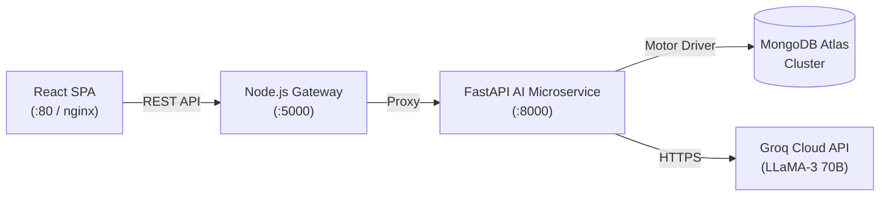

# 🛡️ Enterprise CX Guardian AI — Production AI Microservice & Conversational Platform

[](https.github.com/enterprise-cx/ai-microservice/actions/workflows/ci.yml)
[](https://fastapi.tiangolo.com)
[](https://nodejs.org)
[](https://react.dev)
[](https://www.mongodb.com)
[](https://www.docker.com)
[](#license)

**Enterprise CX Guardian AI** is a multi-tier, production-ready microservice architecture designed for high-throughput AI customer experience automation, real-time ticket analytics, and conversational intelligence. Built with **FastAPI**, **Node.js Express**, **React + Vite**, and **MongoDB**, powered by **Groq LLaMA-3 (70B)**.

---

## 📋 Table of Contents

- [Project Overview](#-project-overview)
- [Key Features](#-key-features)
- [System Architecture](#-system-architecture)
- [Installation & Setup](#-installation--setup)
- [Configuration (.env)](#-configuration-env)
- [API Documentation & Endpoints](#-api-documentation--endpoints)
- [Docker & Production Deployment](#-docker--production-deployment)
- [Screenshots Placeholder](#-screenshots-placeholder)
- [Future Scope & Roadmap](#-future-scope--roadmap)

---

## 🎯 Project Overview

Enterprise CX Guardian AI addresses the scalability and persistence challenges of enterprise customer interaction management. It replaces ad-hoc LLM integrations with an enterprise-grade AI microservice featuring:

- **10-Step Chat Execution Pipeline**: State-machine-driven prompt assembly, token tracking, and dual-layer persistence.
- **Clean Architecture Infrastructure Layer**: Strict interface separation (`IConversationRepository`, `IMessageRepository`, `IPromptRepository`, `IUsageRepository`) allowing zero-downtime database swapping (MongoDB ↔ Redis ↔ PostgreSQL ↔ Azure Cosmos DB).
- **Soft Delete Lifecycle**: Full audit compliance supporting `ACTIVE`, `ARCHIVED`, and `DELETED` states.
- **In-Memory Telemetry & Metrics Engine**: Rolling window metrics tracking p50/p90/p99 latencies, error rates, and CPU/memory utilization.

---

## ✨ Key Features

### 1. Conversational AI Core
- **Groq LLaMA-3-70B Integration**: Sub-100ms inference response times.
- **Sliding History Window**: Dynamically bounds prompt size (`MAX_HISTORY` turns) to maintain context without token overflow.
- **Prompt Auditing**: Automatically saves every raw prompt payload into `prompt_logs` for compliance and optimization.
- **Token Telemetry**: Captures `prompt_tokens`, `completion_tokens`, `total_tokens`, and `latency_ms` on every completion.

### 2. Multi-Service Architecture & API Versioning
- **Dual API Support**: Clean `/api/v1` namespace with built-in `/api/v2` migration readiness and `/api/versions` discovery endpoint.
- **Decoupled Gateway**: Express Node.js backend handles client session routing while delegating AI inference to the FastAPI microservice.

### 3. Production Security & Hardening (Feature 6)
- **Secure Headers (Helmet)**: Strict CSP, HSTS, X-Frame-Options: DENY, X-Content-Type-Options: nosniff.
- **Sliding Window Rate Limiting**: Per-IP limits across Auth (10/min), Chat (60/min), and API (200/min).
- **Input Sanitization**: XSS, script tag, and null-byte (`\x00`) stripping across query and payload segment parsing.
- **Request Size Guards**: Hard payload limits preventing request smuggling or payload inflation attacks.

### 4. Advanced Performance & Optimization (Feature 7)
- **Dual Response Compression**: GZip compression for responses > 512 bytes.
- **In-Memory ETag Cache**: Read caching with `304 Not Modified` conditional validation and automated mutation cache-busting.
- **MongoDB Index Suite**: Auto-creating compound, unique, and TTL self-expiring indexes.
- **Async Background Task Queue**: Offloads non-blocking analytics and telemetry writes to background workers.

---

## 🏗️ System Architecture

Detailed sequence, ER, and microservice diagrams are available in [`docs/architecture.md`](docs/architecture.md).



---

## ⚙️ Installation & Setup

### Prerequisites
- **Docker Desktop** >= 24.0 (Recommended for one-command startup)
- **Node.js** >= 20.x & **npm** >= 10.x (For local non-containerized dev)
- **Python** >= 3.11 (For standalone AI service execution)
- **MongoDB** >= 7.0 (Local instance or MongoDB Atlas URI)

### Quick Start (One-Command Docker Compose)

```bash
# 1. Clone the repository
git clone https://github.com/enterprise-cx/ai-microservice.git
cd ai-microservice

# 2. Configure environment variables
cp .env.example .env
# Edit .env and insert your GROQ_API_KEY

# 3. Launch full stack (Client + Server + AI Microservice + MongoDB)
docker compose up --build
```

Access the applications at:
- **Frontend App**: `http://localhost:80`
- **Node Backend Gateway**: `http://localhost:5000`
- **FastAPI AI Microservice**: `http://localhost:8000`
- **Swagger Interactive API Docs**: `http://localhost:8000/docs`

---

## 🔑 Configuration (.env)

| Variable | Default Value | Description |
|---|---|---|
| `ENVIRONMENT` | `production` | Execution mode (`development` / `production` / `test`) |
| `GROQ_API_KEY` | `gsk_...` | **REQUIRED**. Free key from https://console.groq.com |
| `MONGODB_URI` | `mongodb://...` | MongoDB Atlas or container connection string |
| `DATABASE_NAME` | `cx_guardian_db` | Database name shared across microservices |
| `JWT_SECRET_KEY` | `32+ char secret` | **REQUIRED**. JWT signing key |
| `MODEL_NAME` | `llama3-70b-8192` | Groq LLM model selection |
| `MAX_HISTORY` | `10` | Conversation turns sliding window limit |
| `STORAGE_BACKEND` | `mongodb` | Storage factory backend (`mongodb` / `memory`) |

---

## 📡 API Documentation & Endpoints

### API Discovery & Health
- `GET /` — Minimal liveness ping
- `GET /health` — Full system & database health check
- `GET /health/live` — Kubernetes liveness probe
- `GET /health/ready` — Kubernetes readiness probe
- `GET /metrics` — Telemetry metrics (latency percentiles, error rates, CPU/memory)
- `GET /api/versions` — API version discovery metadata

### Core AI & Conversations (`/api/v1`)
- `POST /api/v1/chat` — Execute 10-step chat flow with memory
- `GET /api/v1/conversations` — List conversations (supports `limit`, `page`, `sort`, `status`)
- `GET /api/v1/conversations/{id}` — Fetch conversation details & full message history
- `DELETE /api/v1/conversations/{id}` — Soft delete conversation (`status = DELETED`)
- `PATCH /api/v1/conversations/{id}/archive` — Archive conversation (`status = ARCHIVED`)
- `PATCH /api/v1/conversations/{id}/restore` — Restore conversation (`status = ACTIVE`)

### Dashboard & Analytics (`/api/v1/dashboard`)
- `GET /api/v1/dashboard/summary` — Key performance indicator summary
- `GET /api/v1/dashboard/health` — System CPU, memory & DB ping metrics
- `GET /api/v1/dashboard/model-usage` — LLM token consumption & throughput
- `GET /api/v1/dashboard/conversations` — Active/Archived status breakdown
- `GET /api/v1/dashboard/users` — Active user session metrics
- `GET /api/v1/dashboard/documents` — RAG vector store & retrieval hit rates

---

## 🐳 Docker & Production Deployment

All services feature multi-stage `Dockerfile` configurations:
- **Client**: Build stage (Node.js) → Production stage (nginx alpine with SPA routing).
- **Server**: Dependency stage → Production stage (running as non-root user `nodeapp`).
- **AI Service**: Builder stage → Production stage (running as `aiuser` with `uvicorn` + `uvloop`).

```bash
# Production Container Health Inspection
docker compose ps

# Container Logs Tracking
docker compose logs -f ai-service
```

---

## 🖼️ Screenshots Placeholder

> *Place application screenshots below when deployed:*

| Dashboard Overview | Real-time Chat UI | Swagger API Documentation |
|:---:|:---:|:---:|
| `` | `` | `` |

---

## 🚀 Future Scope & Roadmap

- [ ] **Vector Database Integration**: Native Qdrant / Pinecone integration for enterprise knowledge retrieval.
- [ ] **Server-Sent Events (SSE) Streaming**: Real-time token-by-token response streaming in `/api/v2/chat`.
- [ ] **Multi-Model Orchestration**: Dynamic fallback switching between Groq LLaMA-3, Claude 3.5, and OpenAI GPT-4o.
- [ ] **Prometheus Exporter**: Native `/metrics` export formatted for Prometheus scrapers and Grafana dashboards.
- [ ] **Multi-Tenant Workspace Partitioning**: Tenant-level isolation for enterprise organizations.

---

## 📄 License

Proprietary — All Rights Reserved. Enterprise CX Guardian AI © 2026.
