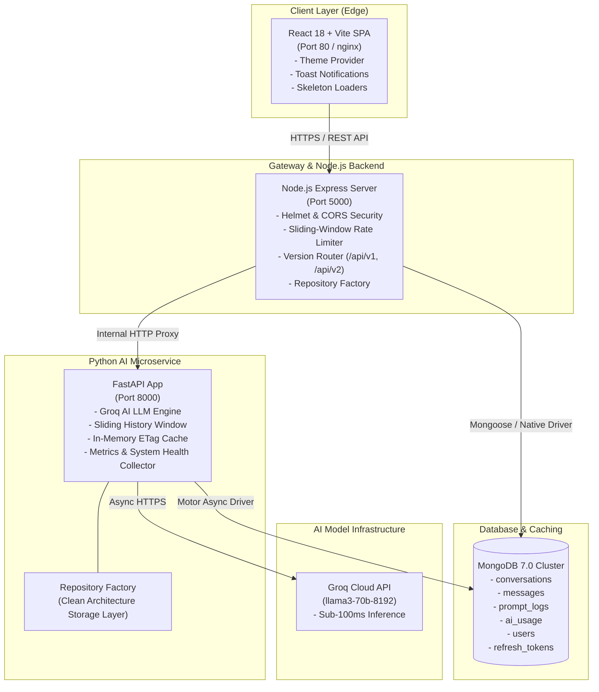
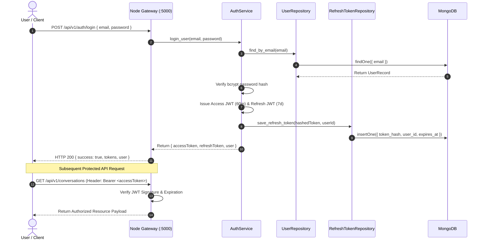
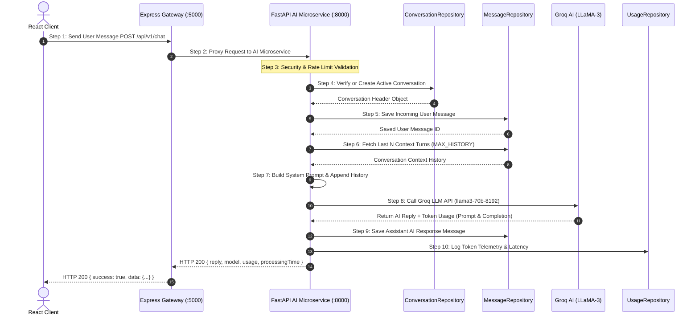
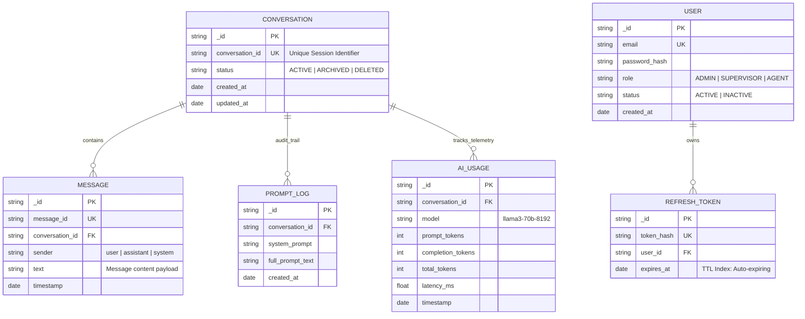
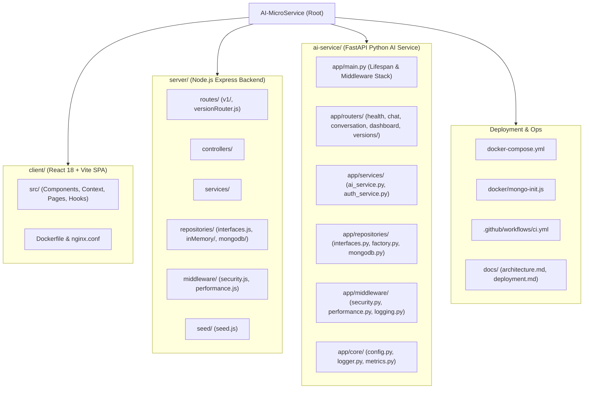

# Enterprise CX Guardian AI — Comprehensive System Architecture & Design Specification

This document contains full Mermaid architectural diagrams illustrating system topology, microservice communication, security authentication workflows, AI chat execution, RAG knowledge retrieval, database schemas, and monorepo structure.

---

## 1. System Architecture Diagram

---

## 2. Microservice Flow Diagram

```mermaid
flowchart LR
    subgraph Frontend ["Edge Frontend"]
        SPA["React SPA"]
    end

    subgraph BackendGateway ["Express Node Gateway"]
        AuthMw["JWT Guard"]
        VRouter["Version Router (/api/v1)"]
        CacheMw["LRU ETag Cache"]
        ProxyModule["Axios AI Proxy"]
    end

    subgraph AIMicroservice ["FastAPI AI Service"]
        SecMw["Security & Rate Limiter"]
        PerfMw["GZip & ETag Middleware"]
        LLMEngine["Groq AIServiceManager"]
        RepoFactory["RepositoryFactory"]
    end

    subgraph Persistence ["MongoDB Storage"]
        Colls[("Conversations\nMessages\nPrompt Logs\nUsage Telemetry")]
    end

    SPA -->|1. Request| AuthMw
    AuthMw --> VRouter
    VRouter --> CacheMw
    CacheMw -->|Miss| ProxyModule
    ProxyModule -->|2. HTTP Proxy| SecMw
    SecMw --> PerfMw
    PerfMw --> LLMEngine
    LLMEngine --> RepoFactory
    RepoFactory -->|3. Persist / Fetch| Colls
    LLMEngine -->|4. Groq Inference| Groq[Groq LLaMA-3]
    Groq -->|5. Token Stream| LLMEngine
    LLMEngine -->|6. JSON Response| SPA
```

---

## 3. Authentication & JWT Authorization Flow Diagram

---

## 4. 10-Step AI Request & Chat Execution Flow Diagram

---

## 5. RAG (Retrieval-Augmented Generation) Knowledge Flow Diagram

```mermaid
flowchart TD
    subgraph Ingestion ["1. Document Ingestion"]
        Doc["Uploaded Policy PDF / DOCX"] -->|Text Extraction| Chunks["Text Chunks\n(500 char windows)"]
        Chunks -->|Embeddings Engine| Vectors["Vector Embeddings\n(1536-dim)"]
        Vectors -->|Index| VectorStore[("In-Memory LRU Vector Store / MongoDB")]
    end

    subgraph QueryExecution ["2. Query Retrieval & Context Injection"]
        UserMsg["User Message"] -->|Query Vectorizer| QueryVec["Query Embedding"]
        QueryVec -->|Cosine Similarity Search| TopK["Top-K Matching Chunks\n(Threshold > 0.75)"]
        TopK --> ContextBlock["Formatted Context Block"]
        ContextBlock --> PromptBuilder["System Prompt Builder"]
        PromptBuilder --> LLM["Groq LLaMA-3 Inference"]
        LLM --> Response["Ground Truth AI Response"]
    end
```

---

## 6. Database ER Diagram (MongoDB Collections & Relationships)

---

## 7. Monorepo Folder Structure Diagram

