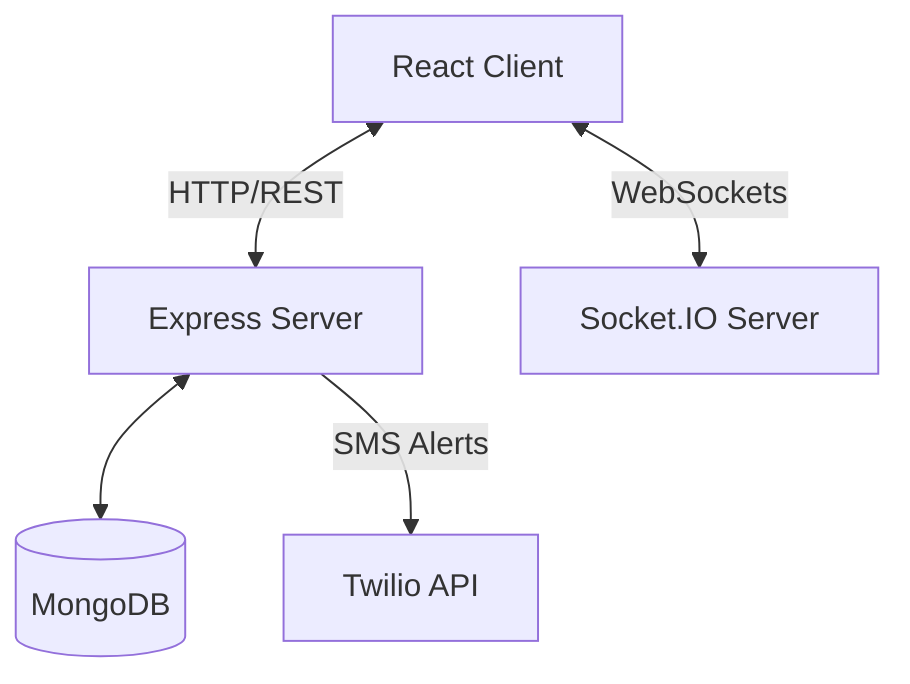

# System Architecture

This document describes the architectural layout and flow of Enterprise CX Guardian AI.

## Architecture Diagram

## Folder Layout
The project uses a monorepo setup with npm workspaces:
- `client/`: React frontend powered by Vite.
- `server/`: Modular Node.js/Express MVC backend.
- `docs/`: Product architecture, visual maps, and investor pitch.

## Core Interactions
1. **Authentication**: Users authenticate via JWT.
2. **Safety Scoring**: Client queries server for route evaluation; server compares paths using public routing engines and risk datasets to assign safety ratings.
3. **Emergency SOS**: Active client emits `sos-alert` via Socket.IO, logging details to MongoDB and firing SMS via Twilio.
