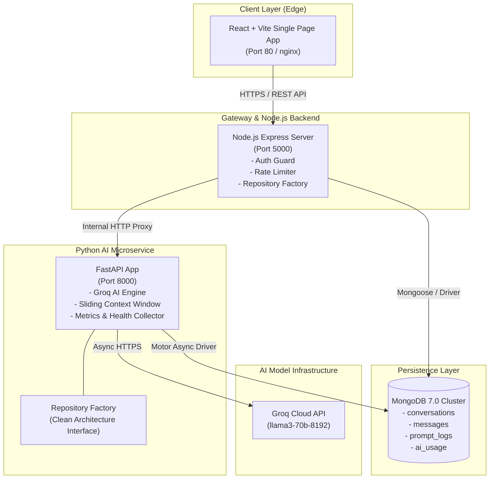
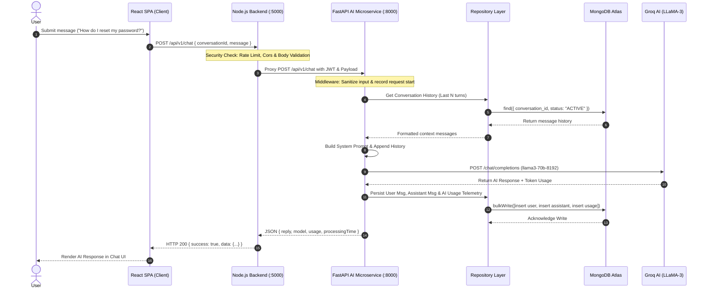
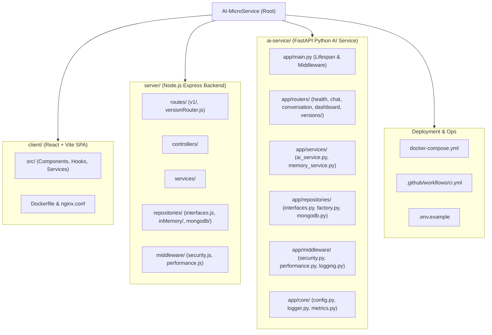
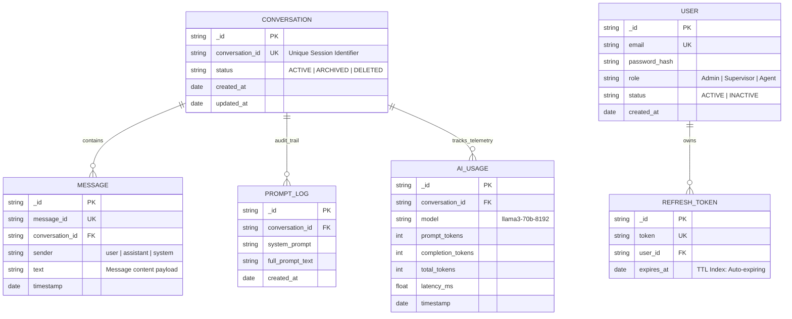
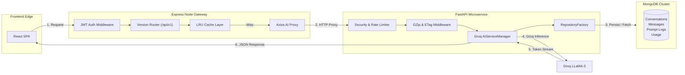

# Enterprise CX Guardian AI — System Architecture & Design Documentation

## 1. High-Level System Architecture Diagram

---

## 2. End-to-End Chat Execution Sequence Diagram

---

## 3. Monorepo Folder Structure Diagram

---

## 4. Database ER Diagram (MongoDB Collections)

---

## 5. Microservice Flow Architecture

